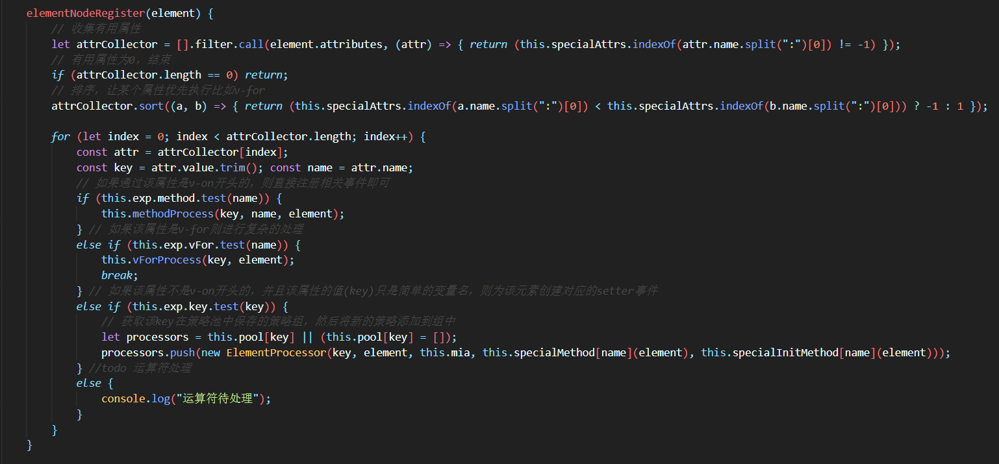
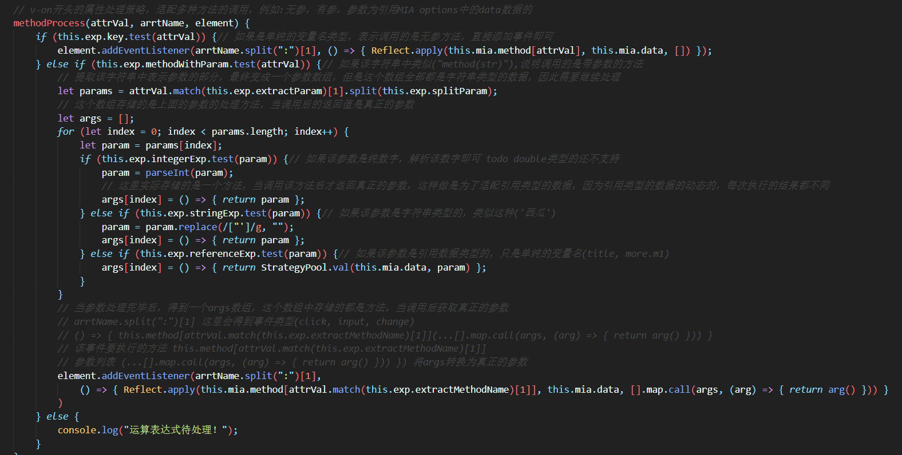

# MIA

> a simple mvvm framework 这是一个简单的双向绑定框架

## 简介

这个东西目前还是一个练习性质的作品，编写的动机是某天在写一个小东西的时候，感觉需要用到双向绑定，但是又不想引用第三方的东西，感觉实现一个简单的双向绑定的功能应该不难，于是搜索了一下双向绑定的原理。便开始了编写。

初期使用了object.defineproperty()的方式用来监听set赋值事件，之后改成了更为强大的Proxy(代理对象模式)。

目前使用的方式和VUE一样，如v-指令和{{引用}}。内部实现的原理基本是原创，没有借鉴其他的双向绑定框架。

## 功能支持

> 目前一些比较基本的双向绑定的功能已经实现

### 支持的功能有 :

- v-on:事件名

  - > 例 v-on:click="say" v-on:input="say('你好')" v-on:change="say(data区中的某个属性名)"

- v-model

  - > 双向绑定，可以使用在input option标签上，绑定在checkbox上如果只绑定了一个checkbox那么绑定的值是true和false，如果绑定到多个checkbox上，则绑定是值是一个数组，绑定到radio上，绑定的内容是radio的value中定义的值。
    >
    > 下一步将会支持option的多选情况。

- v-value

  - > 单向绑定某个元素的值

- v-for

  - > 目前还相对简单，只支持类似v-for="item in items", 如果item是一个对象，那么可以在v-value value 和 {{}}上使用item来引用item的属性。之后会继续构建功能，
    >
    > 下一步支持index索引值、自元素引用，这样的话，v-scope 域引用指令也会更新进来

### 下一步

目前的更新到这里将会和VUE的操作方式分道扬镳，指令也可能会发生更改。

接下来会将剩余的一些基本双向绑定功能完善。

如果在继续更新下去，那么主要的方向具备自身特点的新特性、新功能。

#### 将要更新的东西:

- v-for功能完善，index索引支持
- 表达式支持
- v-text v-html
- data中Object不再全覆盖的创建Proxy对象，而是根据页面上引用到的数据来创建，就是之前的反向创建Proxy对象
- 虚拟DOM研究，首先会查看目前的方式和虚拟DOM那个性能较高。
- v-html 功能会是v-html="subplane/somepage.html"这样的，会将这个网页下的内容追加到该元素之中，类似iframe。

### 核心逻辑

To Be Continued...

